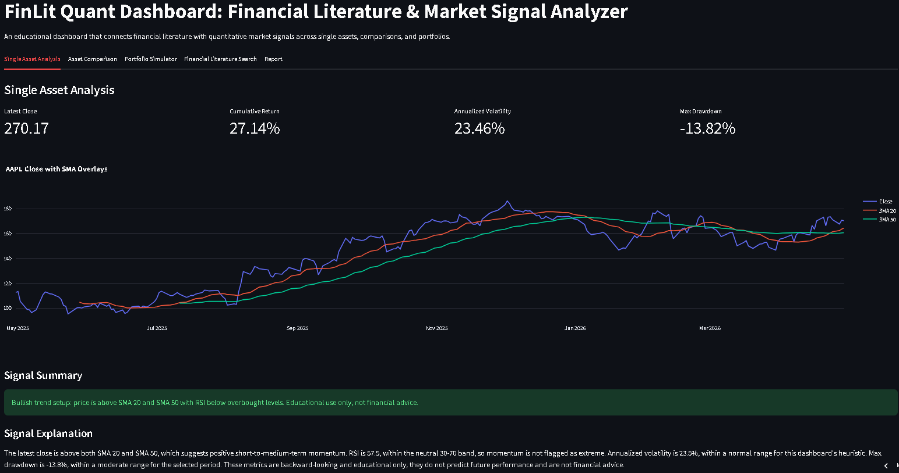
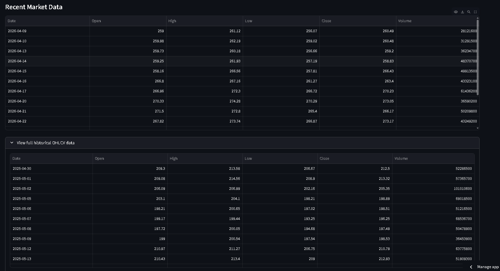
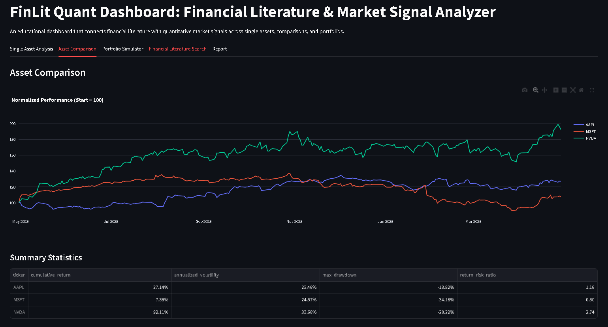
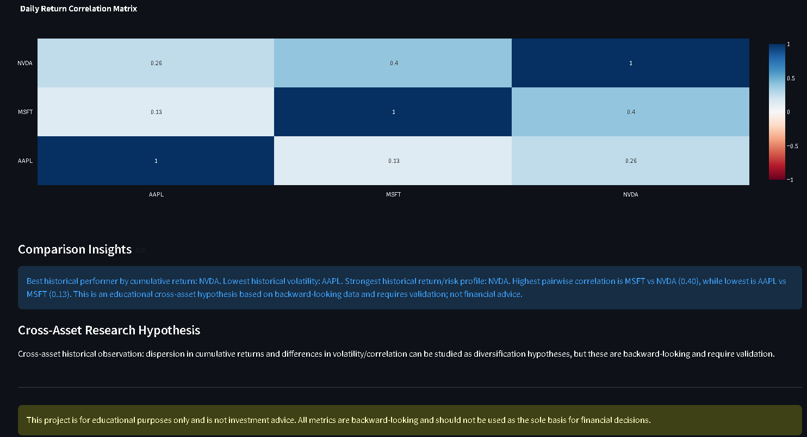
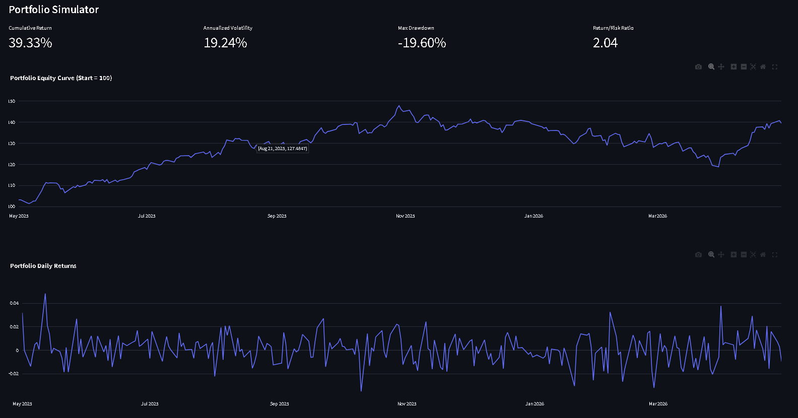
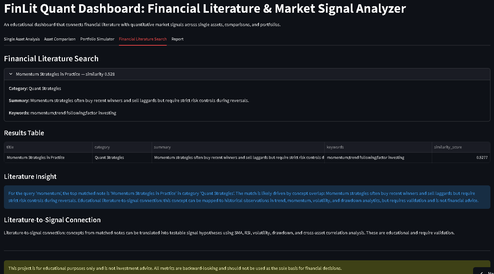
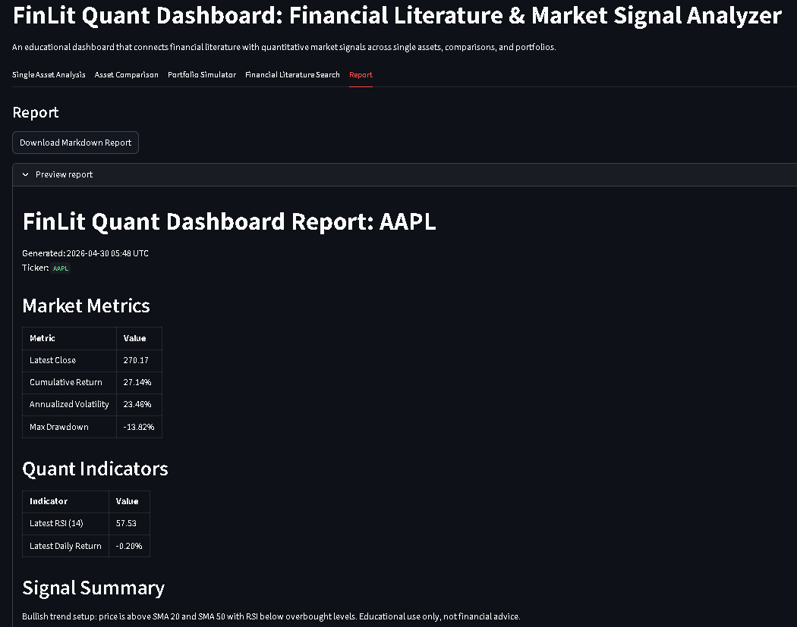

# FinLit Quant Dashboard

[](https://www.python.org/)
[](https://streamlit.io/)
[](https://docs.pytest.org/)
[](.github/workflows/tests.yml)
[](https://fellowship.mlh.io/)
[](#educational-disclaimer)

**Live Demo:** https://finlit-quant-dashboard.streamlit.app/

---

## 1) Project Overview
FinLit Quant Dashboard is a modular Python + Streamlit application that connects financial literature concepts to market signal analysis. It is designed as an educational code sample that combines quant metrics, explainable narratives, and information retrieval in a single product workflow.

## 2) Problem Statement
Many learners study terms like momentum, volatility, drawdown, and diversification separately from real market data. That separation makes concept-to-practice transfer difficult.

## 3) Why This Project Exists
This project bridges that gap by:
- mapping literature themes to quantitative observations,
- presenting historical indicators in an interpretable UI,
- and reinforcing hypothesis-based reasoning rather than advice-driven outputs.

## 4) Features
- **Single Asset Analysis** with close-price chart, SMA overlays, RSI, cumulative return, annualized volatility, max drawdown, and educational signal explanation.
- **Recent + Full OHLCV views** for transparency and inspection.
- **Asset Comparison** with normalized performance curves, summary metrics, and correlation matrix.
- **Portfolio Simulator** with weight parsing/validation, portfolio return series, risk metrics, and allocation visualization.
- **TF-IDF Literature Search** over curated finance notes with cosine-similarity ranking and fallback substring matching.
- **Educational Insight Text** across tabs (single-asset, cross-asset, portfolio, literature-to-signal connection).
- **Downloadable Markdown Report** with metrics, explanations, literature matches, and disclaimer.

## 5) Screenshots
> Screenshot placeholders are wired to the exact expected paths below. If files are missing locally, add screenshots with these exact filenames.

### Single Asset Analysis


### Recent Market Data


### Asset Comparison


### Correlation Matrix


### Portfolio Simulator


### Financial Literature Search


### Report Preview


## 6) Tech Stack
- Python 3.11+
- Streamlit
- pandas
- numpy
- yfinance
- plotly
- scikit-learn
- pytest
- GitHub Actions (CI)

## 7) Architecture
- `app.py` — Streamlit UI orchestration and tab-level flow.
- `src/data_loader.py` — market data retrieval and validation.
- `src/indicators.py` — daily returns, SMA, EMA, RSI.
- `src/risk_metrics.py` — cumulative return, volatility, drawdown.
- `src/comparison.py` — multi-asset price alignment, normalization, correlation and summary stats.
- `src/portfolio.py` — portfolio weight parsing, validation, returns, metrics.
- `src/literature_search.py` — CSV loading, TF-IDF ranking, substring fallback.
- `src/explainability.py`, `src/signal_summary.py`, `src/alpha_insights.py` — educational signal/explanation generation.
- `src/reporting.py` — markdown report generation for download.
- `data/literature_notes.csv` — curated finance literature corpus.
- `tests/` — module-aligned unit tests.

## 8) Folder Structure
```text
finlit-quant-dashboard/
├── .github/
│   └── workflows/
│       └── tests.yml
├── assets/
│   ├── single_asset_analysis.png
│   ├── recent_market_data.png
│   ├── asset_comparison.png
│   ├── correlation_matrix.png
│   ├── portfolio_simulator.png
│   ├── literature_search.png
│   └── report_preview.png
├── app.py
├── data/
│   └── literature_notes.csv
├── src/
│   ├── __init__.py
│   ├── alpha_insights.py
│   ├── comparison.py
│   ├── data_loader.py
│   ├── explainability.py
│   ├── indicators.py
│   ├── literature_search.py
│   ├── portfolio.py
│   ├── reporting.py
│   ├── risk_metrics.py
│   └── signal_summary.py
├── tests/
│   ├── __init__.py
│   ├── test_alpha_insights.py
│   ├── test_indicators.py
│   ├── test_literature_search.py
│   ├── test_portfolio.py
│   ├── test_reporting.py
│   ├── test_risk_metrics.py
│   └── test_signal_summary.py
├── README.md
├── requirements.txt
├── .gitignore
├── sample_requests_or_usage.md
└── LICENSE
```

## 9) Installation
Create and activate a virtual environment:

```bash
python -m venv .venv
```

**Windows (PowerShell):**
```powershell
.venv\Scripts\activate
```

**macOS / Linux:**
```bash
source .venv/bin/activate
```

Install dependencies:

```bash
python -m pip install --upgrade pip
python -m pip install -r requirements.txt
```

## 10) Running the App
```bash
streamlit run app.py
```

Alternative:

```bash
python -m streamlit run app.py
```

## 11) Running Tests
```bash
pytest
```

Alternative:

```bash
python -m pytest
```

## 12) GitHub Actions CI
CI is defined in `.github/workflows/tests.yml` and runs on push + pull requests to `main` and `master`. The workflow sets up Python 3.11, installs `requirements.txt`, and runs `pytest`.

## 13) Example Tickers
- `AAPL`
- `MSFT`
- `NVDA`
- `TSLA`
- `INFY.NS`
- `TCS.NS`
- `RELIANCE.NS`

## 14) Example Literature Queries
- `momentum`
- `volatility risk`
- `interest rates valuation`
- `drawdown capital preservation`
- `diversification`
- `inflation earnings`
- `liquidity risk appetite`

## 15) Educational Signal Hypotheses
The dashboard intentionally uses educational framing in each major tab:
- **Educational Signal Hypothesis**
- **Cross-Asset Research Hypothesis**
- **Portfolio Risk Hypothesis**
- **Literature-to-Signal Connection**

All interpretations are backward-looking historical observations that require validation.

## 16) MLH Code Sample Fit
This repository demonstrates:
- modular Python software engineering,
- testable quant-logic functions,
- market data API integration,
- TF-IDF information retrieval,
- streamlit product design,
- explainable educational output,
- report generation,
- and CI-backed quality checks.

## 17) What I Learned
- Designing app-level workflows with clean module boundaries.
- Building reusable, unit-tested analytics functions.
- Combining retrieval + quant analysis in one educational product.
- Communicating uncertainty clearly with non-advisory language.

## 18) Limitations
- Depends on external free market data behavior/availability.
- Metrics are historical and not predictive.
- Literature corpus is intentionally compact and curated.
- No brokerage integration or execution layer (by design).

## 19) Future Improvements
- Add benchmark overlays (e.g., index-relative context).
- Expand literature corpus breadth and tagging depth.
- Add richer scenario tooling for portfolio stress-style exploration.
- Add linting/type-check stages to CI.

## 20) Educational Disclaimer
This project is for educational purposes only and is not investment advice. All metrics and narratives are backward-looking and should not be used as the sole basis for financial decisions.
